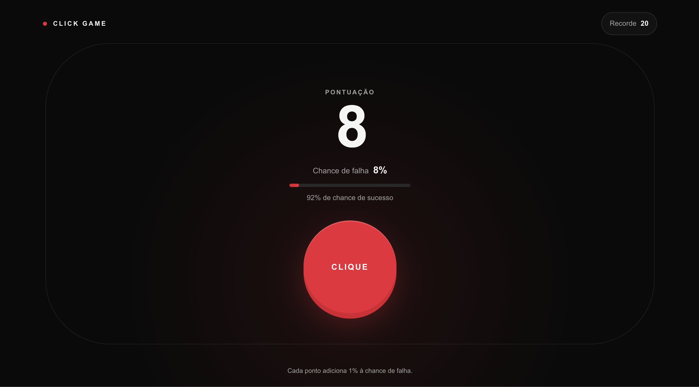
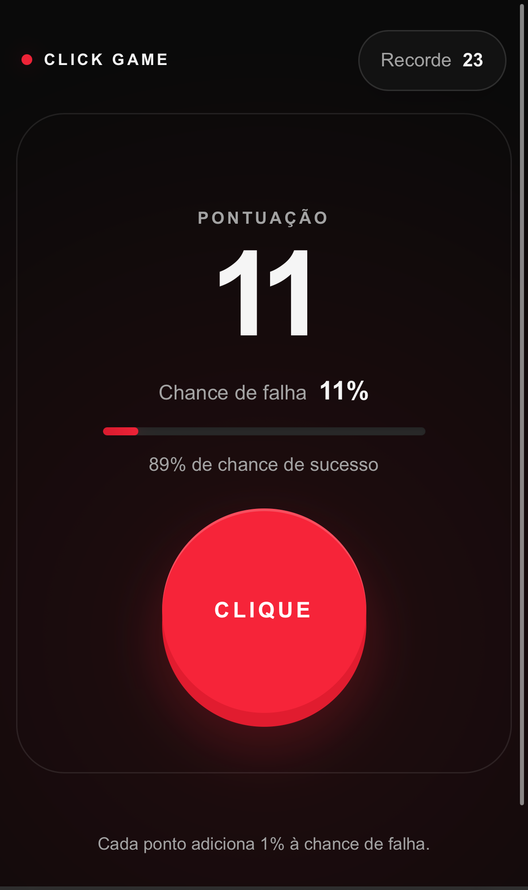

# Click Game

Um jogo web minimalista de risco progressivo: clique para marcar pontos, mas saiba que cada ponto aumenta em `1%` a chance de perder a rodada.

**[Jogar agora](https://click-game-iota.vercel.app)**

## Sobre o jogo

O Click Game transforma uma única ação em uma decisão cada vez mais tensa. A rodada começa com `0%` de chance de falha. A cada clique bem-sucedido, a pontuação aumenta e o próximo clique se torna mais arriscado.

O objetivo é simples: conquistar a maior pontuação possível antes da primeira falha.

## Evidências visuais

### Versão web



### Versão mobile

<p align="center">
  
</p>

As duas versões preservam a mesma hierarquia visual: pontuação em destaque, risco facilmente identificável e uma única ação principal. No celular, dimensões e espaçamentos são ajustados pelo tamanho da viewport para manter todos os elementos legíveis e acessíveis.

## Como jogar

1. Pressione o botão **Clique** para tentar marcar um ponto.
2. Se o clique for bem-sucedido, a pontuação aumenta em `1`.
3. A chance de falha do próximo clique passa a ser igual à pontuação atual.
4. A primeira falha encerra a rodada e exibe a pontuação final.
5. Use **Tentar novamente** para iniciar uma nova rodada sem apagar o recorde local.

| Pontuação atual | Chance de sucesso | Chance de falha | Próximo sucesso |
| ---: | ---: | ---: | ---: |
| 0 | 100% | 0% | 1 ponto |
| 1 | 99% | 1% | 2 pontos |
| 25 | 75% | 25% | 26 pontos |
| 99 | 1% | 99% | 100 pontos |
| 100 | 0% | 100% | Falha obrigatória |

Em termos de regra, o cálculo central é:

```ts
const failureChance = Math.min(score, 100)
const failed = Math.random() * 100 < failureChance
```

## Funcionalidades

- Mecânica de risco progressivo entre `0%` e `100%`.
- Pontuação e probabilidades atualizadas imediatamente após cada clique.
- Barra visual que acompanha o crescimento do risco.
- Recorde salvo no `localStorage` do navegador.
- Estado de fim de rodada com pontuação final e indicação de novo recorde.
- Reinício posicionado fora da região do botão principal, evitando cliques acidentais durante sequências rápidas.
- Layout responsivo para desktop e dispositivos móveis.
- Temas claro e escuro baseados na preferência do sistema.
- Animações curtas com suporte a `prefers-reduced-motion`.
- Controles compatíveis com mouse, toque e teclado.

## Decisões de experiência

A interface usa alto contraste e reserva o vermelho para a ação principal e para a comunicação de risco. O contorno da arena permanece dentro dos limites da tela, enquanto o botão se adapta tanto à largura quanto à altura disponível.

O jogo abre pronto para uso, sem cadastro ou etapas intermediárias. Ao fim da rodada, o botão **Tentar novamente** aparece acima da pontuação final e afastado da antiga posição do botão de clique. Isso reduz a possibilidade de reiniciar sem intenção quando o jogador está clicando rapidamente.

Para acessibilidade, a implementação inclui:

- Elementos de botão nativos e foco visível.
- Rótulos acessíveis com as probabilidades atuais.
- Atualizações de pontuação anunciadas por uma região `aria-live`.
- Anúncio assertivo quando a rodada termina.
- Informação apresentada por texto e números, sem depender apenas de cor.
- Áreas de toque confortáveis e suporte às áreas seguras de dispositivos móveis.

## Tecnologias

- [Next.js](https://nextjs.org/) com App Router
- [React](https://react.dev/)
- TypeScript
- Tailwind CSS e estilos globais
- Componentes acessíveis baseados em Base UI/Shadcn
- Node.js Test Runner para os testes da regra
- `localStorage` para persistência do recorde no dispositivo

O jogo não depende de cadastro, API ou banco de dados para funcionar.

## Executando localmente

### Requisitos

- Node.js `22.x`
- npm

### Instalação

```bash
git clone https://github.com/rafaalt/click-game.git
cd click-game
npm install
npm run dev
```

Abra [http://localhost:5173](http://localhost:5173) no navegador. Se a porta estiver ocupada, o ambiente de desenvolvimento informará a próxima porta disponível.

## Validação

Execute os testes automatizados da mecânica:

```bash
npm test
```

Gere uma versão de produção:

```bash
npm run build
```

Os testes cobrem os limites mais importantes da probabilidade: primeiro clique, `1%`, `99%`, falha obrigatória em `100%` e normalização de pontuações inválidas.

## Estrutura principal

```text
click-game/
├── app/
│   ├── globals.css          # Tema, layout e responsividade
│   ├── layout.tsx           # Metadados e estrutura global
│   └── page.tsx             # Página principal
├── assets/
│   ├── mobile.png           # Evidência da versão mobile
│   └── web.png              # Evidência da versão desktop
├── components/
│   └── click-game.tsx       # Estado, interface e interações
├── lib/
│   └── game.ts              # Regras puras de pontuação e falha
├── tests/
│   └── game.test.ts         # Testes determinísticos da mecânica
└── README.md
```

## Persistência

O recorde é armazenado apenas no navegador, usando a chave `click-game:best-score:v1`. Valores inválidos são ignorados e a indisponibilidade do armazenamento não impede uma partida. Recarregar a página reinicia a rodada atual, mas preserva o melhor resultado no mesmo dispositivo.
